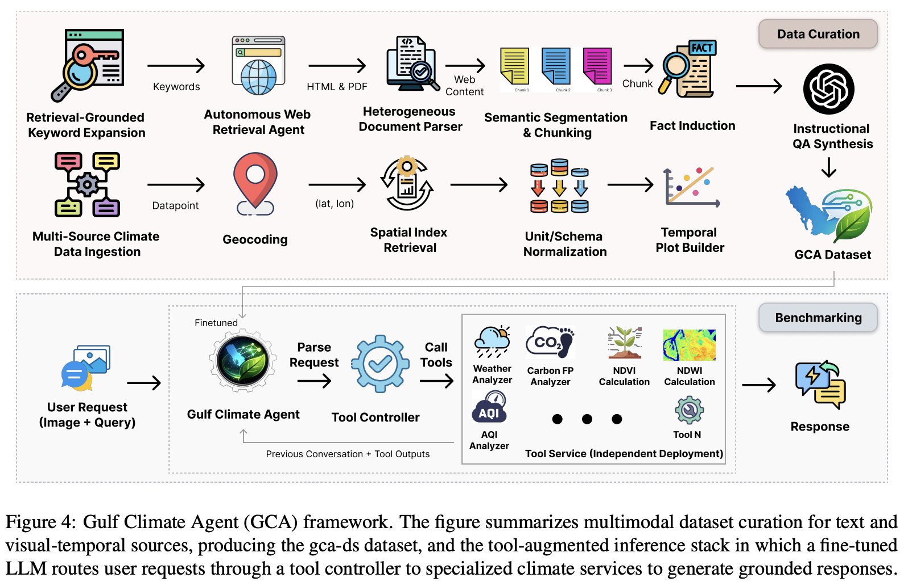

# GCA Framework: A GCC Countries-Grounded Dataset and Agentic Pipeline for Climate Decision Support

**Authors**  
Muhammad Umer Sheikh, Khawar Shehzad, Salman Khan, Fahad Shahbaz Khan, Muhammad Haris Khan

## Links

- **arXiv:** <https://arxiv.org/abs/2604.12306>
- **Project Website:** <https://www.gulfclimateagent.com/>
- **Hugging Face:** <https://huggingface.co/umer-sheikh/gca>

## Main Method



## Abstract

GCA is a GCC-focused climate decision-support framework that combines a multimodal dataset with a tool-augmented agent for grounded climate reasoning. The project brings together region-specific policy and scientific evidence, remote sensing signals, environmental time series, and climate-service tools into a single workflow for question answering and analysis. In this repository, the paper's agentic design is implemented as a modular Python system with a tool controller, typed tool interfaces, normalized outputs, and benchmark utilities for reproducible experiments across retrieval, weather, air quality, biodiversity, carbon estimation, and remote sensing tasks.

## Table of Contents

- [Installation](#installation)
- [Benchmark](#benchmark)
- [Code Structure](#code-structure)
- [Run Experiments](#run-experiments)
- [Citation](#citation)
- [Contact](#contact)
- [Acknowledgement](#acknowledgement)

## Installation

### 1. Create the environment

```bash
python -m venv .venv
source .venv/bin/activate
pip install --upgrade pip
pip install -e ".[dev,remote,audio]"
```

### 2. Configure environment variables

```bash
cp .env.example .env
```

Set the required keys and runtime configuration in `.env`.

Required for the full stack:

- `OPENAI_API_KEY`
- `TAVILY_API_KEY`
- `OPEN_METEO_API_KEY`
- `EARTH_ENGINE_PROJECT`
- `EARTH_ENGINE_SERVICE_ACCOUNT_EMAIL`
- `EARTH_ENGINE_SERVICE_ACCOUNT_JSON`
- `BIRD_MODEL_PATH`
- `BIRD_LABELS_PATH`
- `BIOCLIP_BIN`

## Benchmark

- **Hugging Face:** <[https://huggingface.co/umer-sheikh/gca](https://huggingface.co/datasets/umer-sheikh/gca-bench)>

## Code Structure

```text
gulf-climate-agent/
|- configs/                        # Example runtime configurations
|- docs/                           # Documentation and figures
|- examples/                       # Example prompts and usage
|- scripts/                        # Agent, benchmark, and smoke-test entry points
|- src/gulf_climate_agent/
|  |- agent/                       # Agent assembly and runtime loop
|  |- benchmarks/                  # Benchmark schemas and runners
|  |- cli/                         # Command-line interfaces
|  |- config/                      # Environment and settings loading
|  |- contracts/                   # Typed tool input/output contracts
|  |- controller/                  # Tool routing logic
|  |- core/                        # Shared runtime utilities
|  |- infra/                       # External provider integrations
|  |- tools/                       # LangChain tools exposed to the LLM
|  `- assets/                      # Local model and support assets
`- tests/                          # Unit tests
```

## Run Experiments

### List all registered tools

```bash
gca-agent --list-tools
```

### Run the agent on a natural-language query

```bash
gca-agent --query "Analyze AQI trends for Doha between 2024-01-01 and 2024-01-07" --trace
```

### Invoke a tool directly

```bash
gca-agent --tool geocode_mapping --payload '{"region":"Doha"}'
```

### Run the benchmark harness

```bash
gca-benchmark --cases src/gulf_climate_agent/benchmarks/cases/sample_cases.jsonl --json
```

### Run smoke tests and unit tests

```bash
python scripts/smoke_test.py
pytest
```

## Citation

```bibtex
@article{sheikh2026gca,
  title={GCA Framework: A GCC Countries-Grounded Dataset and Agentic Pipeline for Climate Decision Support},
  author={Sheikh, Muhammad Umer and Shehzad, Khawar and Khan, Salman and Khan, Fahad Shahbaz and Khan, Muhammad Haris},
  journal={arXiv preprint arXiv:2604.12306},
  year={2026},
  doi={10.48550/arXiv.2604.12306}
}
```

## Contact

**iumerusman@gmail.com**

## Acknowledgement

We thank the authors, collaborators, and the broader open-source and climate-data communities that make grounded climate-agent research possible.
